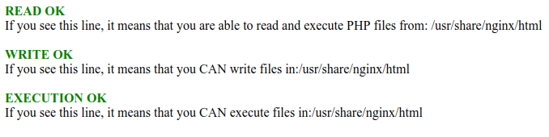

# Docker volumes and permissions

This repository shows you a way to deal with read/write/exec permissions
and how to define user and group ids using volumes from the host, when running containers.

Indeed, user uid and gid are often different in the container and on the host system.
And it's possible to use the same docker configuration on different hosts (local, test, stating,...)
and with possibly different users from a uid/gid point of view.

So if you want to use volumes, you need to understand how to configure the permissions of the project/folder
mapped into your containers.

## Docker images

For this demo project we are relying on two simple docker alpine images:

* [Nginx (nginx:1.13.9-alpine)](https://hub.docker.com/_/nginx/)
* [PHP-FPM (php:7.2.3-fpm-alpine3.7)](https://hub.docker.com/_/php/)

We are using the nginx image directly simply overriding the configuration file with our own
to be able to use PHP-FPM running in the `php` container.

```bash
location ~ ^/index\.php(/|$) {
    fastcgi_pass php:9000;
    ...
    internal;
}
```

For the PHP-FPM image we are building our own form the `php:7.2.3-fpm-alpine3.7` because we need to
add a custom entry point to deal with permissions.

## The problem

We have a problem if we use a volume to share our code from host to container.

* The user running `php-fpm` in the container is `wwww-data` with `uid=100` and `gid=101`.
* Our host user often has `uid=1000` and `gid=1000` but not always.
* The `nginx` user will not be able to read/write/exec files from the volume if permissions are not defined properly.

But I do not recommend to change permissions with `chmod` directly.
The way I recommend is to change the owner of the shared directory to map uid and gid of the container user
to the host user.

## The Dockerfile and entry point to change uig/gid

The interesting part of the Dockerfile is this one:

```bash
ARG PROJECT_DIR_ARG='/usr/share/nginx/html'
ENV PROJECT_DIR=$PROJECT_DIR_ARG

RUN mkdir -p $PROJECT_DIR
COPY ./project $PROJECT_DIR
RUN chown -R www-data:www-data $PROJECT_DIR
```

* In the entry point we are checking if uid and gid of the container user `nginx` must be changed.

```bash
# --
PHP_UID_DEFAULT=$(id -u www-data)

# Here we check if GID and UID are already defined properly or not
# i.e Do we have a volume mounted and with a different uid/gid ?
if [[ -z "$(ls -n $PROJECT_DIR | grep $PHP_UID_DEFAULT)" ]]; then

    : ${PHP_UID:=$(id -u www-data)}
    : ${PHP_GID:=$(id -g www-data)}

    export PHP_UID
    export PHP_GID

    if [ "$PHP_UID" != "0" ] && [ "$PHP_UID" != "$(id -u www-data)" ]; then
      echo "Need to change UID and GID."
      usermod  -u $PHP_UID www-data
      groupmod -g $PHP_GID www-data
      chown -R www-data:www-data $PROJECT_DIR
      echo "UID and GID changed to $PHP_UID and $PHP_GID."
    fi
else
    echo "UID and GUI are OK !"
fi
```

* The possible new values are coming from environment variables.

```yaml
php:
    build:
      context: .
    environment:
      - PHP_UID=${PHPUID}
      - PHP_GID=${PHPGID}
```

* We can define per-host custom UID/GID environment varaibles with a `.env` file.

```bash
PHPUID=1000
PHPGID=1000
```

# Run the demo

```bash
$ git clone git@github.com:ypereirareis/docker-permissions.git && cd docker-permissions
```

* Copy `.env.dist` to `.env` and set your uid and gid values.
* Comment/Uncomment volume from `docker-compose.yml`

```yaml
services:
  php:
    volumes:
      - ./project:/usr/share/nginx/html
```

```bash
$ docker-compose build

```

```bash
$ docker-compose up
Starting ypr-permissions-php ... 
Starting ypr-permissions-php ... done
Recreating ypr-permissions-nginx ... 
Recreating ypr-permissions-nginx ... done
Attaching to ypr-permissions-php, ypr-permissions-nginx
ypr-permissions-php | UID and GUI are OK !
ypr-permissions-php | [07-Mar-2018 16:35:37] NOTICE: fpm is running, pid 1
ypr-permissions-php | [07-Mar-2018 16:35:37] NOTICE: ready to handle connections
```

Go to [http://127.0.0.1:8888/](http://127.0.0.1:8888/)

If everything is ok, you should see:




# LICENSE

MIT License

Copyright (c) 2018 Yannick Pereira-Reis

Permission is hereby granted, free of charge, to any person obtaining a copy
of this software and associated documentation files (the "Software"), to deal
in the Software without restriction, including without limitation the rights
to use, copy, modify, merge, publish, distribute, sublicense, and/or sell
copies of the Software, and to permit persons to whom the Software is
furnished to do so, subject to the following conditions:

The above copyright notice and this permission notice shall be included in all
copies or substantial portions of the Software.

THE SOFTWARE IS PROVIDED "AS IS", WITHOUT WARRANTY OF ANY KIND, EXPRESS OR
IMPLIED, INCLUDING BUT NOT LIMITED TO THE WARRANTIES OF MERCHANTABILITY,
FITNESS FOR A PARTICULAR PURPOSE AND NONINFRINGEMENT. IN NO EVENT SHALL THE
AUTHORS OR COPYRIGHT HOLDERS BE LIABLE FOR ANY CLAIM, DAMAGES OR OTHER
LIABILITY, WHETHER IN AN ACTION OF CONTRACT, TORT OR OTHERWISE, ARISING FROM,
OUT OF OR IN CONNECTION WITH THE SOFTWARE OR THE USE OR OTHER DEALINGS IN THE
SOFTWARE.